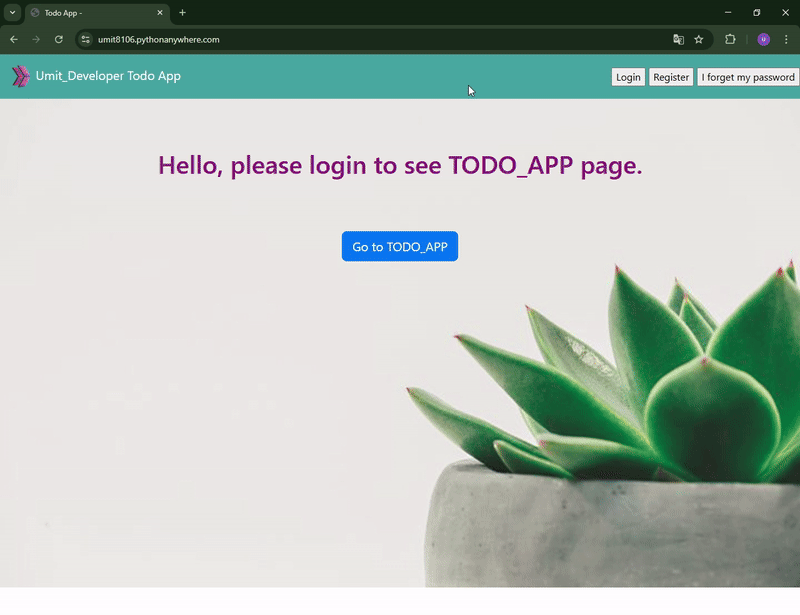
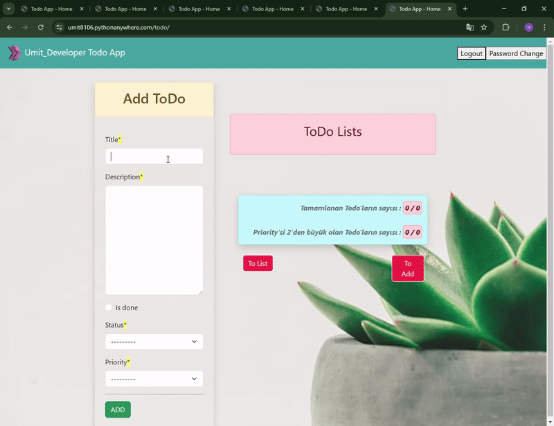

<!-- Please update value in the {}  -->

<p align="center">
  
  
  
  
  
  
</p>

<h1 align="center">✅ Django Template Todo App</h1>

<p align="center">
A full-stack Todo application built with Django Templates and Class-Based Views.
</p>

<div align="center">
  <h3>
    <a href="https://umit8105.pythonanywhere.com/">
      🖥️ Live Demo
    </a>
     | 
    <a href="https://github.com/Umit8098/Project_Django_Templates_Authantication-1_Todo_App_Class_Based_CH-11.git">
      📂 Repository
    </a>
 
  </h3>
</div>


## Navigation

- [Overview](#overview)
- [Built With](#built-with)
- [How To Use](#how-to-use)
- [About This Project](#about-this-project)
- [Acknowledgements](#acknowledgements)
- [Contact](#contact)

<!-- OVERVIEW -->

## Overview

This Todo application allows authenticated users to create, update, and manage their tasks using a clean and simple interface built with Django Templates.



---
- Todo App


---

## Built With

<!-- This section should list any major frameworks that you built your project using. Here are a few examples.-->

- Django Templates
- Bootstrap5
- HTML
- CSS

## How To Use

<!-- This is an example, please update according to your application -->

To clone and run this application, you'll need [Git](https://github.com/Umit8098/Project_Django_Templates_Authantication-1_Todo_App_Class_Based_CH-11)

When installing the required packages in the requirements.txt file, review the package differences for windows/macOS/Linux environments. 

Complete the installation by uncommenting the appropriate package.


```bash
# Clone this repository
$ git clone https://github.com/Umit8098/Project_Django_Templates_Authantication-1_Todo_App_Class_Based_CH-11.git

# Install dependencies
    $ python -m venv env
    $ python3 -m venv env (for macOs/linux OS)
    $ env/Scripts/activate (for win OS)
    $ source env/bin/activate (for macOs/linux OS)
    $ pip install -r requirements.txt
    $ python manage.py migrate (for win OS)
    $ python3 manage.py migrate (for macOs/linux OS)

# Create and Edit .env
# Add Your SECRET_KEY in .env file

"""
# example .env;

SECRET_KEY =123456789abcdefg...
"""

# Run the app
    $ python manage.py runserver
```

## About This Project

This project is a full-stack Todo application where users can securely manage their tasks after authentication.  
It is built using Django Templates and Class-Based Views to demonstrate clean architecture and reusable components.


## Acknowledgements
- [Bootstrap5](https://getbootstrap.com/) - CSS framework
- [crispy-forms](https://django-crispy-forms.readthedocs.io/en/latest/) - form CSS framework

## Contact

<!-- - Website [your-website.com](https://{your-web-site-link}) -->
- GitHub [@Umit8098](https://github.com/Umit8098)

- Linkedin [@umit-arat](https://linkedin.com/in/umit-arat/)
<!-- - Twitter [@your-twitter](https://{twitter.com/your-username}) -->
